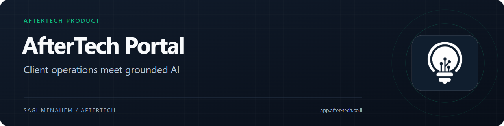

# AfterTech Portal

A client portal for AfterTech, with account and billing workflows and a Hebrew-first support agent available through web chat and WhatsApp.

**Project:** Product for my own software business
**My role:** Sole developer, from architecture and implementation to deployment and maintenance
**Source:** Private application; this repository is a public case study

[Visit the portal](https://app.after-tech.co.il/) · [Try support on AfterTech](https://www.after-tech.co.il/)

## Preview

Mobile, English and embedded chat views

Client accounts, documents and administrative screens are behind authentication and are not shown here.

## Problem and solution

I needed a place to manage client-facing operations and answer recurring questions about the business. The portal combines accounts, billing-related workflows and support, while the public AfterTech site remains a separate marketing application.

The support agent uses the same knowledge and retrieval pipeline across the embedded web widget and WhatsApp. It retrieves relevant material before answering and can offer to collect enquiry details when the knowledge base does not cover a question.

## Product highlights

- **Grounded support:** Vector and keyword retrieval are combined, then an LLM re-ranks results for the actual question.
- **Shared support channels:** Web chat and WhatsApp use the same agent logic, with separate conversation identities.
- **Client operations:** Authenticated account pages and integrations for billing documents and hosted payment workflows.
- **Administrative tools:** Client, lead and support-issue management alongside agent analytics.
- **Hebrew-first experience:** Right-to-left layouts with English support, including language-aware prompts and content.

## Engineering decisions

### Retrieval before generation

PostgreSQL full-text search and pgvector similarity are fused with Reciprocal Rank Fusion. A re-ranking step selects passages relevant to the question. When none remain, the agent is instructed to acknowledge the gap and offer a next step. This reduces reliance on unsupported assumptions; it does not make every answer correct.

### Shared logic with conversation boundaries

The web and WhatsApp channels share prompts, retrieval and tools, while their conversation identities stay separate. Follow-up memory processing happens after the response so it does not hold up the reply. Public chat has rate limits to bound exposure and usage.

### Operations guarded on the server

Authentication and administrative permissions are checked server-side. Billing integrations use hosted payment requests; clients do not enter card details into the portal itself. Operations with financial consequences have explicit guards and idempotency handling. This separation keeps provider-hosted payment collection distinct from the portal's account and document views.

## Stack and verification

Next.js · React · TypeScript · Tailwind CSS · Supabase/PostgreSQL · pgvector · Drizzle · Vercel AI SDK · Gemini · SUMIT · Green API · Vercel

The project includes automated tests, Hebrew-language agent evaluations and production error monitoring. Checks cover application behaviour and the agent's language and grounding requirements. Application code, client information and operational configuration remain private.

---

Built by **[Sagi Menahem](https://www.sagimenahem.tech/)**, founder of **[AfterTech](https://www.after-tech.co.il/)**.
[LinkedIn](https://www.linkedin.com/in/sagi-menahem/) · [Contact](mailto:sagiia1997@gmail.com)
