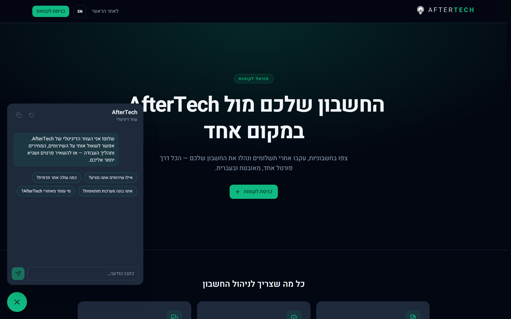
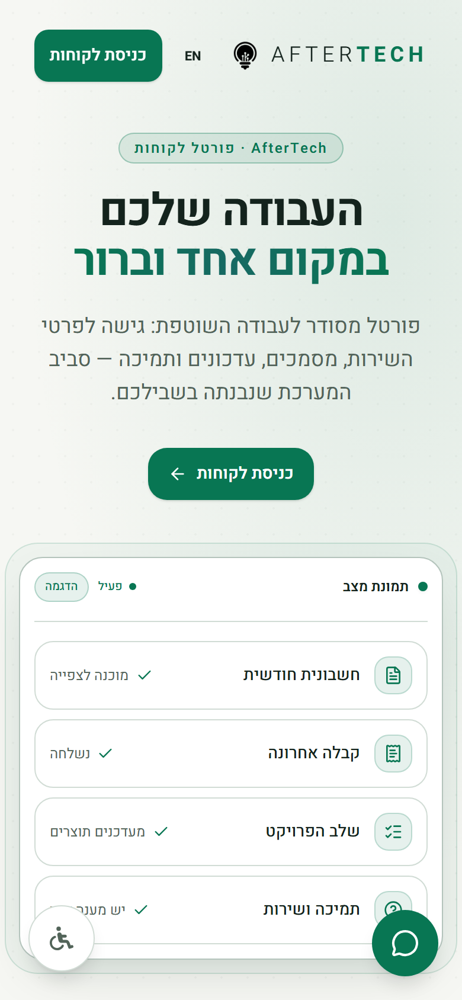
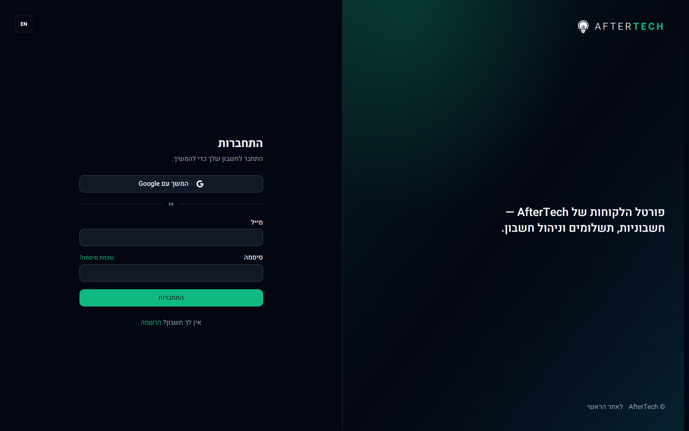
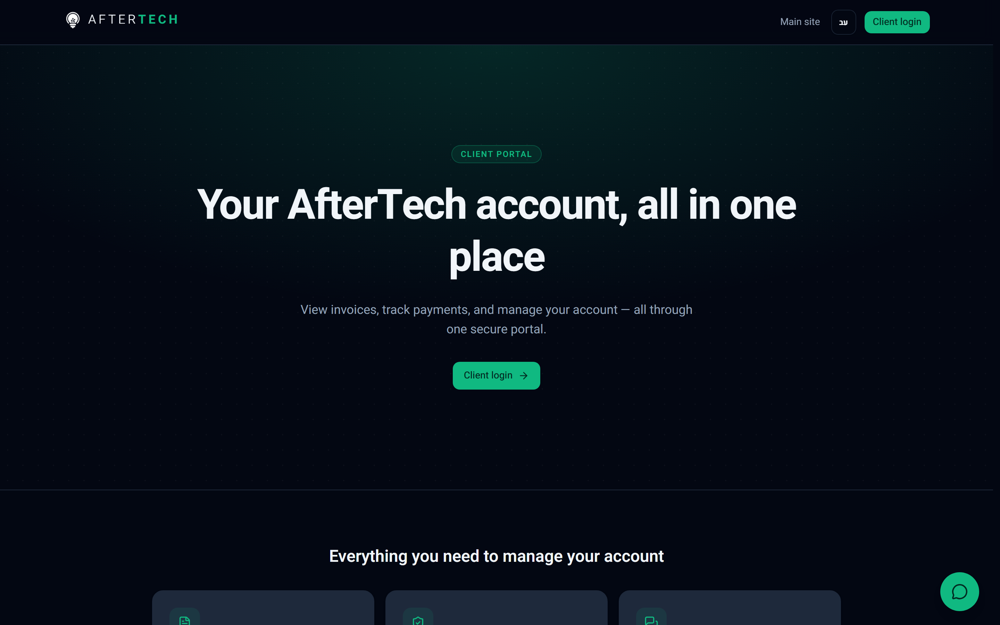
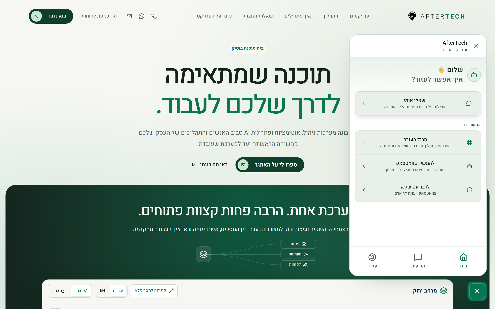

<div align="center">
  <h1>AfterTech Portal</h1>
  <p><strong>Client Billing Portal & Hebrew-First RAG Support Agent</strong></p>
  <p>A production Next.js 16 portal running the client side of my own web agency — invoices, hosted-page payments and account settings — plus a retrieval-grounded Gemini agent that answers in Hebrew on two channels at once: WhatsApp and a chat widget embedded in the marketing site. Bilingual (he/en), RTL-first, dark-only. Live and still being extended.</p>

  <p>
    <a href="https://app.after-tech.co.il" target="_blank">
      
    </a>
  </p>

  <br/>

  
  
  
  
  
  
  
  
  
  
</div>

---

## Preview

<div align="center">
  <table>
    <tr>
      <td align="center" valign="top">
        
        <br/><sub><b>Portal gateway + agent · Desktop · Hebrew RTL</b></sub>
      </td>
      <td align="center" valign="top">
        
        <br/><sub><b>Agent widget · Mobile</b></sub>
      </td>
    </tr>
    <tr>
      <td align="center" valign="top">
        
        <br/><sub><b>Client login · Google OAuth + email</b></sub>
      </td>
      <td align="center" valign="top">
        
        <br/><sub><b>Same page · English LTR</b></sub>
      </td>
    </tr>
    <tr>
      <td align="center" valign="top" colspan="2">
        
        <br/><sub><b>The same agent, embedded cross-origin in the Next.js marketing site</b></sub>
      </td>
    </tr>
  </table>
</div>

> Signed-in surfaces — the client statement, payment flow and the admin panel — are behind
> authentication and are not shown here.

---

## About

**AfterTech Portal** is the client-facing system for my own web agency: clients sign in to see
their invoices and receipts, pay through a hosted SUMIT payment page, and choose how they get
notified; I run the accounts, leads, issues and agent analytics from an admin panel behind the
same app. Built end-to-end as the sole engineer. The codebase itself is private — this README is
the portfolio-facing summary covering the architecture, engineering decisions, and screenshots
that I can share publicly.

What makes it different from a typical billing dashboard is that the support layer is a
retrieval-grounded LLM agent rather than a contact form, and it is **one agent, not two
integrations**: the same prompt, retrieval stack and memory serve a WhatsApp business line and
a chat widget embedded cross-origin in the agency's marketing site, keyed only by
`channel:identity`. It is live in production and still being extended.

---

## Highlights

- **Hybrid retrieval, not just a vector search** — dense pgvector cosine and Postgres full-text
  ranking are fused with Reciprocal Rank Fusion inside one SQL function, then an LLM reranker
  re-orders against the original query and drops passages that don't answer it
- **Grounded by construction** — if the reranker keeps nothing, the agent says it doesn't know
  and offers to take details, instead of filling the gap
- **Two channels, one brain** — WhatsApp (Green API) and the site widget share the prompt,
  knowledge base, tools and memory; conversations are keyed `whatsapp:<phone>` /
  `widget:<sessionId>`
- **Agentic memory with a session boundary** — durable facts and a rolling summary are distilled
  after each turn; silence past a 12-hour gap starts a fresh conversation that still remembers
  the person, so a returning client is greeted rather than answered mid-sentence
- **13 tables, 15 hand-written SQL migrations** — no migration codegen; indexes, HNSW, generated
  `tsvector` columns and the RLS posture are all written deliberately
- **Money is never computed in-app** — amounts are stored `numeric(10,2)`, read back as strings
  and rendered as-is; SUMIT is the only calculator, and card data never reaches the server
- **Server-side idempotency on every money path** — issuing, charging and opening a standing
  order each claim a UI-minted key in a `billing_operations` ledger
- **The agent's voice is a build gate** — a test fails the build on first-person-plural copy
  anywhere in the prompt, knowledge base, dictionaries or emails
- **Bilingual he/en, RTL-first** — cookie-driven locale, logical Tailwind properties only, with
  a script asserting dictionary parity between the two languages

---

## Tech Stack

| Layer             | Choice                                                                        |
| :---------------- | :---------------------------------------------------------------------------- |
| **Framework**     | Next.js 16 (App Router, `cacheComponents`) + React 19 + TypeScript strict      |
| **Styling**       | Tailwind CSS v4 + Radix primitives, dark-only design system, CSS-only animation |
| **Database**      | Supabase Postgres (pgvector, pg_trgm) + Drizzle ORM (types only) + hand-written SQL migrations |
| **Auth**          | Supabase Auth — email/password + Google OAuth; server-side admin guards        |
| **AI**            | Vercel AI SDK v7 + Gemini — `gemini-3.5-flash` (chat), `gemini-3.1-flash-lite` (rerank/extraction), `gemini-embedding-2` @ 768d |
| **Retrieval**     | pgvector HNSW (cosine) + `tsvector` GIN, fused with Reciprocal Rank Fusion, then LLM reranking |
| **Messaging**     | Green API (WhatsApp business line) + Resend (transactional email)              |
| **Billing**       | SUMIT — hosted payment pages, documents and standing orders                    |
| **Rate limiting** | Upstash Redis — per-IP plus a global daily cap on the public chat endpoint     |
| **Observability** | Sentry + optional Langfuse tracing over OpenTelemetry                          |
| **Tests / Evals** | Vitest + a promptfoo Hebrew Q&A suite judged by an LLM rubric                  |
| **Hosting**       | Vercel (`fra1`), two daily cron jobs                                           |

---

## Architecture

```
                     ┌────────────────────────────────────────────────┐
                     │                    Vercel (fra1)               │
                     │      Next.js 16 · App Router · Node fns         │
   client ─────────► │                                                │
                     │  (auth)      login / register / OAuth callback  │
                     │  (account)   client statement · settings        │
                     │  (dashboard) admin: clients, leads, issues,     │
                     │              agent analytics, audit log          │
   marketing site ──►│  /api/chat            streaming, CORS-scoped    │
   (Next, separate)  │  /api/leads           contact form → lead        │
                     │  /api/whatsapp/webhook  idempotent inbound      │
   WhatsApp ────────►│  /api/cron/*          keepalive · reconcile     │
                     └───┬────────────┬───────────┬──────────┬─────────┘
                         │            │           │          │
                         ▼            ▼           ▼          ▼
                 Supabase Postgres  Gemini    Green API    SUMIT
                 (pgBouncer 6543)   (AI SDK)  (WhatsApp)  (billing +
                 pgvector · FTS                            documents)
                         │                                    │
                         ▼                                    ▼
                 Supabase Auth                         Resend · Sentry · Langfuse
```

**Chat request flow:** message → per-IP and global daily rate limit → embed the query with the
retrieval-side template → hybrid search (`pgvector` + FTS, RRF-fused in SQL) → LLM rerank and
drop irrelevant passages → stream an answer with tools available → after the response,
`after()` defers an extraction pass that writes deduplicated long-term facts and a rolling
summary.

---

## Major Systems

### Hybrid Retrieval
`hybrid_search_knowledge()` runs a dense pgvector cosine search and a `tsvector 'simple'`
full-text search over the same knowledge base and fuses the two rankings with Reciprocal Rank
Fusion in one SQL round trip. Hebrew is why both halves exist: the `'simple'` configuration is
used deliberately because Postgres has no Hebrew stemmer, so exact-term matching covers what an
embedding blurs, and the embedding covers the paraphrase the keyword search misses. A
flash-lite reranker then re-orders the fused list against the original question and discards
passages that don't answer it — the same step that produces the grounding guarantee, because
an empty result set is the signal to say "I don't know" rather than a reason to lower the bar.

### The Agent
Built on the Vercel AI SDK's `streamText`, so the provider is a one-line swap. Four tools:
`searchKnowledge` (hybrid + rerank), `captureLead`, `reportIssue` (opens a tracked ticket with
a `new → triaged → in_progress → resolved` lifecycle) and `getMyAccount`, which is only
injected into the tool set when the caller is a linked, signed-in client — an anonymous widget
session can't reach it because it does not exist for that request. `stopWhen: isStepCount(5)`
bounds multi-step tool use. Retrieved passages and stored memories are framed as data, never as
instructions. Asking for a human routes straight to my personal number instead of negotiating.

### Agentic Memory
Short-term history lives in `conversations`/`messages`; long-term facts and a rolling summary
live in `memories` with their own HNSW index, recalled semantically. Extraction is incremental:
existing facts are shown to the extractor with an only-new instruction, and each returned fact
must clear an embedding-similarity duplicate guard (≥0.92 similarity is dropped) before it is
stored, capped at 50 per subject. The server owns the history — widgets send only
`{ sessionKey, message }`, never a transcript they could rewrite.

### WhatsApp Channel
Inbound Green API webhooks are bearer-authenticated (failing closed in production), per-IP rate
limited, and made idempotent by claiming each `idMessage` in a `processed_webhook_events`
ledger with `INSERT … ON CONFLICT DO NOTHING`, because Green API re-delivers. A sender whose
number matches a client record is recognized and linked to their account; anyone can wipe their
own history with a reset keyword. The handler returns 200 promptly so a slow answer can never
trigger a redelivery storm.

### Embedded Widget
The marketing site is a separate Next.js app on a different origin, so the widget talks to
`/api/chat` cross-origin against an explicit allow-list with a handled preflight, and sends no
credentials — widget sessions are anonymous by design, identified by a client-generated
session key the server validates. The endpoint carries both a per-IP limit and a global daily
cap: the second one exists to bound the bill on a public, unauthenticated LLM endpoint, and the
route fails closed if the limiter isn't configured in production.

### Billing
SUMIT is the billing engine; the portal is the control surface. Card details never touch the
server — only hosted payment pages and tokenization, with SUMIT identifiers stored locally. The
browser's return from a payment is treated as a hint, not as truth: the app re-asks SUMIT for
the payment record and reads its validity flag. A hosted payment writes a `pending` row before
the browser leaves and passes its id as SUMIT's external identifier, so an abandoned checkout is
visible rather than silent; it resolves on evidence (a document appearing for that client),
and the reconcile cron marks anything still pending after 48 hours as abandoned. Standing
orders live inside SUMIT — there is no charging cron here by design.

### Notifications
One dispatch function is the only way a client is told about money, delivering on whichever
channels their preference allows. Each channel is independent — one failing never blocks the
other — and a delivery failure never propagates to the caller, because a receipt that didn't
send must not turn a completed payment into an error on the client's screen; if every chosen
channel fails, I get alerted instead. Copy for both channels is composed in one place so
WhatsApp and email can't drift apart, and every delivered notice is appended to the client's
WhatsApp thread so the agent doesn't deny a receipt it just sent.

### Admin Panel
Seven sections across nine pages: dashboard, clients (list, create and a per-client detail view
with SUMIT linking and invoice sync), leads, issues, agent analytics, audit log and settings.
Leads and issues were insert-only until these pages landed —
the agent could open them and nothing could move them off `new`. Sensitive mutations are
audit-logged, and the guard functions, not the UI, are the security boundary.

---

## Engineering Decisions Worth Highlighting

### RLS enabled everywhere with zero policies — deny-all, on purpose
The app reaches Postgres through the pooler as a role RLS doesn't apply to, so the policies
never governed anything the app does; what they governed was Supabase's REST layer, which
nothing here uses. Keeping them meant keeping that door open — and one of them let a signed-in
customer rewrite their own email row over REST and be linked to another client's billing
history on the next visit. The policies were dropped along with the `SECURITY DEFINER` helper
that existed only to serve them and was callable over RPC. Deny-all is the deliberate end
state, not an unfinished one.

### Thinking level pinned to `minimal`
Gemini 3 bills thinking tokens at the output rate and defaults to `medium`. Measured against
the real key: at `low` the chat model burned roughly 380 thinking tokens per turn and, against
an 800-token output budget, sometimes spent the budget thinking and truncated the reply. At
`minimal` it produced complete, fluent Hebrew answers with zero thinking tokens. A support chat
doesn't need deep reasoning, so this is both the cheaper and the better-behaved setting — the
main cost lever after the 3.x price increase.

### Asymmetric retrieval expressed in the text, not a parameter
`gemini-embedding-2` dropped the `task_type` parameter its predecessor had, so query and
document embeddings are distinguished by the literal templates they're wrapped in. That makes
the two sides silently coupled: change a template and both the knowledge base and every stored
memory have to be re-embedded together, or retrieval degrades without erroring. The dimension
is pinned to 768 rather than the 3072 default — HNSW-indexable and cheaper.

### Idempotency is a ledger, and the key rotates only on success
Every operation that issues a document, charges a card or opens a standing order claims a
UI-minted key in a `billing_operations` table using the same `INSERT … ON CONFLICT DO NOTHING`
idiom as the webhook ledger. Losing the claim means the work already happened: a repeat of a
success returns success, anything else is refused rather than re-run. The key rotating only on
success is what stops a failed attempt from being quietly retried into a double charge.

### A guard test that names every money operation
A test enumerates each operation with a real-world consequence — charging, issuing, opening,
updating and cancelling a standing order — and fails the build if one loses its guard. The
guard requires both an explicit environment flag and production mode. The single deliberate
exception is minting a payment link, where nothing moves until a human enters a card on SUMIT's
own page.

### A failing test for the agent's voice
The prompt forbade first-person-plural in one line and shipped it twenty lines below, in an
example — and the model copies the concrete example, not the abstract rule. The rule is now a
test that scans the prompt, knowledge base, dictionaries and email templates and breaks the
build, which is the only form a style rule survives in.

### Nothing is cached, and that's the end state
Every surface here is account-scoped, operational and mutation-heavy, or auth — so no fetcher
clears the bar for caching, and the tag/profile infrastructure inherited from an e-commerce
template was deleted for having zero consumers. `cacheComponents` stays on for a different
reason: it forces every uncached server read inside a Suspense boundary, so the shell streams
first.

### Analytics removed rather than kept out of habit
Third-party page analytics were dropped: the portal is login-gated for a handful of clients, so
they measured nothing while costing ~134KB of script. What is worth measuring is the agent, and
that data already lives in the conversation, lead and issue tables — surfaced on an admin page
built from them.

---

## Performance & Reliability

- pgBouncer transaction pool on port 6543 with `prepare: false`; pool size tuned per
  environment (build 2 / dev 10 / prod 8)
- HNSW indexes with `vector_cosine_ops` on both the knowledge base and the memory table;
  a generated `tsvector` column with a GIN index backing the keyword half of the search
- `pg_trgm` GIN indexes accelerating admin ILIKE filters
- Output capped at 800 tokens with bounded history, fact and chunk sizes — roughly $5–9/month
  at ~10 chats a day; explicit context caching deliberately unused (the context is small and
  dynamic, below the provider's minimum)
- The public chat endpoint fails closed without its rate limiter in production rather than
  running unmetered
- A daily keepalive cron pings the database, because the free Supabase tier pauses after seven
  idle days; a second daily cron reconciles invoices and expires stale pending payments
- Deferred post-response work via `after()`, so memory extraction never delays a reply
- Langfuse tracing is lazy and gated on its keys — zero load when unset
- A Hebrew eval suite (`promptfoo`, LLM-rubric judged) checks language quality, grounding and
  lead-capture behaviour as the agent's quality gate

---

<div align="center">

**Built by Sagi Menahem**

[](https://github.com/sagi-menahem)
[](https://www.linkedin.com/in/sagi-menahem/)
[](https://sagimenahem.tech)

</div>
